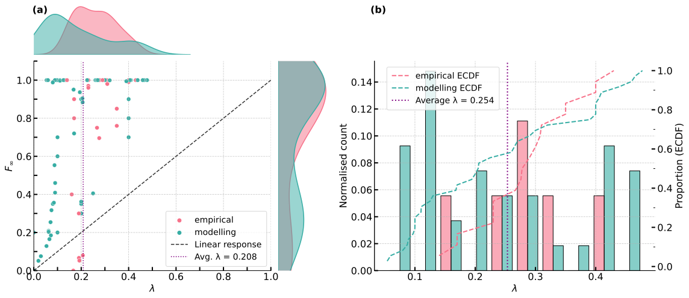

# pareto_tipping
All code for the publication submitted to the ESD:SI on social tipping. 

# *The Pareto effect in tipping social networks: from minority to majority*

by
Jordan Everall,
Fabian Tschofenig,
Jonathan F Donges,
Ilona M Otto

This paper has been submitted for publication in Earth System Dynamics: Special issue on tipping points 

In this project, we conduct a literature review and intercomparison of modelling and empirical results in order to identify general trends in social tipping dynamics on social networks.
Specifically we look at what fraction of a given social group has to engage with a specific norm in order to result in rapid, system wide norm changes.

||
|:--:| 
| (a) The tipping threshold $λ$ and the steady state adopter fraction $F_∞$. Here, we show n = 86 modelling and empirical results from $N = 13$ papers on complex contagion in social networks.  (b) The distribution of tipping thresholds. Here, we classify only social tipping events, i.e. $F_∞>$ 50% of the population, numbering $n = 59$.   |

## Datasets 
The compiled datasets to produce all figures in the manuscript are located in the `Compiled` folder.
Data used to make the main figures Fig. 5 in the manuscript are in `Tipping_threshold_plot.csv` and `Tipping_points_fin_merged_1.csv` respectively. 
Figure 4 is made with `The Pareto effect in tipping social networks_ Tipping Data - Tipping_Data.tsv`. Data shown in Table 4 are in `The Pareto effect in tipping social networks_ Tipping Data - Sheet_main_fig.csv`. 

## Software implementation

All source code used to generate the results and figures in the paper are in
the `Analysis`and `Figures` folders respectively.  Please email me (Jordan) if there are any questions with supplementary scripts or data not covered here. 

## Getting the code

You can download a copy of all the files in this repository by cloning the
[git](https://git-scm.com/) repository:

    git clone https://github.com/foroveralls/pareto_tipping.git

or [download a zip archive]https://github.com/foroveralls/pareto_tipping/archive/refs/heads/master.zip.

## License
This project is open-source, and the data is made available under the terms of the Creative Commons Attribution 4.0 International (CC BY 4.0) license. By using or referencing the data in this repository, you agree to comply with the license terms outlined below.

**License Information:**
The data in this repository is licensed under the Creative Commons Attribution 4.0 International (CC BY 4.0) license. This means you are free to:

- Share: Copy and redistribute the material in any medium or format.
- Adapt: Remix, transform, and build upon the material for any purpose, even commercially.

Under the following conditions:

- Attribution: You must give appropriate credit, provide a link to the license, and indicate if changes were made. You may do so in any reasonable manner, but not in any way that suggests the licensor endorses you or your use.

